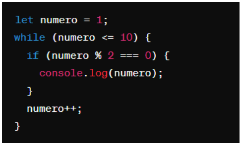
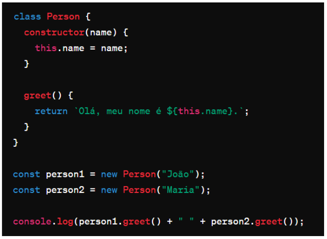

# Instruções

- Faça uma cópia deste arquivo .md para um repositório próprio
- Resolva as 6 questões objetivas assinalando a alternativa correta
- Resolva as 4 questões dissertativas escrevendo no próprio arquivo .md
  - lembre-se de utilizar as estruturas de código como ``esta aqui com ` `` ou
```javascript
//esta aqui com ```
let a = "olá"
let b = 10
print(a)
```
- Resolva as questões com uso do Visual Studio Code ou ambiente similar.
- Teste seus códigos antes de trazer a resposta para cá.
- Cuidado com ChatGPT e afins: entregar algo só para ganhar nota não faz você aprender e ficar mais inteligente. Não seja dependente da máquina!
- ao final, publique seu arquivo lista_01.md com as respostas em seu repositório, e envie o link pela Adalove. 

# Questões objetivas

**1)** O que o código a seguir faz?



Escolha a opção que responde corretamente:

a) Imprime os números pares de 1 a 10.

b) Imprime os números ímpares de 1 a 10.

*c) Imprime os números pares de 2 a 10. <--- Resposta correta*

d) Imprime os números ímpares de 2 a 10.

______

**2)** Identificar a linha que falta no código para criar uma classe Veiculo com atributo marca, e uma classe Carro que herda de Veiculo com um método ligar(). 


No lugar onde está escrito “// linha” qual das opções abaixo deve estar para funcionar corretamente o código?

*A) let carro = new Carro("Toyota");<--- Resposta correta*

B) let ligar = new ligar("Toyota");

C) class Moto extends Veiculo {};

D) carro1.ligar();

______

**3)** Qual é o valor de resultado após a execução deste código?


Escolha a opção que responde corretamente:

*A) 18<--- Resposta correta*

B) 16

C) 14

D) 12

______

**4)** Como você criaria um método `acelerar()` em uma classe `Carro`, que recebe um parâmetro `velocidade` e o adiciona a um atributo `velocidadeAtual`?

*A) <--- Resposta correta*

B) 

C) 

D) 

______

**5)** Qual a forma correta de definir uma classe Carro em JavaScript, com um método ligar() e um atributo marca?

*A) <--- Resposta correta*

B) 

C) 

D) 

______

**6)** Observe o código abaixo:



Qual será a saída do código acima?

A) "Olá, meu nome é João. Olá, meu nome é Maria."

*B) "Olá, meu nome é ."<--- Resposta correta*

C) "João Maria"

D) "undefined undefined"

______

# Questões dissertativas

**7)** Vamos criar um programa em JavaScript para entender classes, métodos e atributos!
Classe Animal:
- Crie uma classe chamada Animal.
- Adicione dois atributos: nome e idade.
- Adicione um método chamado descrever() na classe Animal.
  - Este método deve exibir no console uma descrição do animal com seu nome e idade.

Criando e manipulando Animais:
- Crie dois objetos da classe Animal: um chamado "cachorro" e outro "gato", com idades distintas.
- Para cada animal, chame o método descrever() para ver a descrição no console.

Dica: Utilize `console.log()` para exibir as informações!

*Resposta:*
// Definição da classe Animal
class Animal {
    // Método construtor que recebe nome e idade como parâmetros
    constructor(nome, idade) {
        // Atribuição dos parâmetros aos atributos da classe
        this.nome = nome;
        this.idade = idade;
    }

    // Método para descrever o animal, exibindo seu nome e idade no console
    descrever() {
        console.log(`Nome: ${this.nome}, Idade: ${this.idade}`);
    }
}

// Criação de objetos da classe Animal
const cachorro = new Animal("Help", 5);
const gato = new Animal("Bigode", 3);

// Chamada do método descrever para cada objeto criado
cachorro.descrever();
gato.descrever();


______

**8)** Nos últimos dias tivemos a oportunidade de ter contato com Programação Orientada a Objetos, e tivemos contato com o tema "herança". Herança é um princípio de orientação a objetos, que permite que classes compartilhem atributos e métodos. Ela é usada na intenção de reaproveitar código ou comportamento generalizado ou especializar operações ou atributos. Então vamos praticar esse conteúdo nessa questão.
Vamos criar um programa em JavaScript para entender classes, métodos, atributos e herança!

Classe Animal:
- Crie uma classe chamada Animal.
- Adicione dois atributos: nome e idade.
- Adicione um método descrever() que exiba no console uma descrição do animal com seu nome e idade.

Classe Gato (Herda de Animal):
- Crie uma classe chamada Gato que herda da classe Animal.
- Adicione um atributo extra cor específico para gatos.
- Adicione um método miar() que exiba no console o som que um gato faz.

Criando Animais:
- Crie dois objetos da classe Animal: um chamado cachorro e outro gato, com idades distintas.
- Para o gato, também defina a cor.

Chamando os Métodos:
- Para cada animal, chame o método descrever() para ver a descrição no console.
- Para o gato, chame o método miar() para "ouvir" o som que ele faz (é também para ver o som no console).

Dica: Utilize console.log() para exibir as informações!

*Resposta:*
// Definição da classe Animal comum
class Animal {
    constructor(nome, idade) {
        this.nome = nome;
        this.idade = idade;
    }

    descrever() {
        console.log(`Nome: ${this.nome}, Idade: ${this.idade}`);
    }
}

// Definição da classe Gato que herda de Animal
class Gato extends Animal {
    constructor(nome, idade, cor) {
        // Chamada ao construtor da classe pai utilizando super()
        super(nome, idade);
        // Adição do atributo específico para gatos
        this.cor = cor;
    }

    // Método específico para gatos que exibe o som que um gato faz
    miar() {
        console.log("Miau!");
    }
}

// Criação de objetos das classes Animal e Gato
const cachorro = new Animal("Help", 5);
const gato = new Gato("Bigode", 3, "Branco");

// Chamada dos métodos para cada objeto criado
cachorro.descrever();
gato.descrever();
gato.miar();
______

**9)** Vamos criar um programa em JavaScript para somar notas!

Classe SomadorDeNotas:
- Crie uma classe chamada SomadorDeNotas.
- Adicione um atributo total inicializado com 0 para armazenar a soma das notas.

Método adicionarNota:
- Adicione um método chamado adicionarNota(nota) na classe SomadorDeNotas.
- Este método deve receber um parâmetro nota e somá-lo ao atributo total.

Criando o Somador e Adicionando Notas:
- Crie um objeto da classe SomadorDeNotas, chamado somador.
- Utilize o método adicionarNota(nota) para adicionar algumas notas ao somador.

Chamando o Método para Ver o Total:
- Após adicionar todas as notas, chame um método verTotal() para exibir o total das notas adicionadas.

Dica: Utilize console.log() para exibir as informações!

*Resposta:*
// Definição da classe SomadorDeNotas
class SomadorDeNotas {
    constructor() {
        // Inicialização do atributo total com 0
        this.total = 0;
    }

    // Método para adicionar uma nota ao total
    adicionarNota(nota) {
        this.total += nota;
    }

    // Método para exibir o total das notas no console
    verTotal() {
        console.log(`Total das notas: ${this.total}`);
    }
}

// Criação de um objeto da classe SomadorDeNotas
const somador = new SomadorDeNotas();
// Adição de algumas notas ao somador
somador.adicionarNota(7);
somador.adicionarNota(8.5);
somador.adicionarNota(6.5);
// Chamada do método para ver o total das notas adicionadas
somador.verTotal();
______

**10)** Imagine que você está criando um programa em JavaScript para uma escola. Neste programa, existem diferentes tipos de funcionários, cada um com suas próprias características. Considere as seguintes classes:

Funcionário:
- atributo: Nome
- atributo: Idade
- atributo: Salário base
- método: calcularSalario() - Este método calcula o salário total do funcionário. Para cada tipo de funcionário, o cálculo será diferente.

Professor (herança de Funcionário):
- atributo: Disciplina
- atributo: Horas de aula por semana
- método: calcularSalario() - Para calcular o salário do professor, multiplicamos suas horas de aula pelo valor da hora/aula.

Agora, sua tarefa é escrever um código em JavaScript que crie as classes Funcionário e Professor, com suas características e métodos descritos acima. Depois de criar as classes, crie:
- Dois objetos do tipo Professor com informações fictícias.
- Para cada objeto, chame o método calcularSalario() e mostre o salário calculado no console.

Certifique-se de explicar cada parte do código utilizando comentários, explicando para que serve cada atributo e método, bem como a lógica por trás do cálculo de salário para o tipo de funcionário Professor.

*Resposta:*

// Definição da classe Funcionario
class Funcionario {
    constructor(nome, idade, salarioBase) {
        // Atributos comuns a todos os funcionários
        this.nome = nome;
        this.idade = idade;
        this.salarioBase = salarioBase;
    }

    // Método para calcular o salário, que retorna o salário base
    calcularSalario() {
        return this.salarioBase;
    }
}

// Definição da classe Professor que herda de Funcionario
class Professor extends Funcionario {
    constructor(nome, idade, salarioBase, disciplina, horasAulaSemana, valorHoraAula) {
        // Chamada ao construtor da classe pai utilizando super()
        super(nome, idade, salarioBase);
        // Atributos específicos para professores
        this.disciplina = disciplina;
        this.horasAulaSemana = horasAulaSemana;
        this.valorHoraAula = valorHoraAula;
    }

    // Método para calcular o salário, específico para professores
    calcularSalario() {
        return this.horasAulaSemana * this.valorHoraAula;
    }
}

// Criação de objetos da classe Professor com informações fictícias
const professor1 = new Professor("João", 40, 3000, "Matemática", 20, 50);
const professor2 = new Professor("Maria", 35, 3500, "História", 18, 55);

// Chamada do método calcularSalario() para cada professor e exibição do resultado no console
console.log(`Salário do ${professor1.nome}: ${professor1.calcularSalario()}`);
console.log(`Salário da ${professor2.nome}: ${professor2.calcularSalario()}`);
